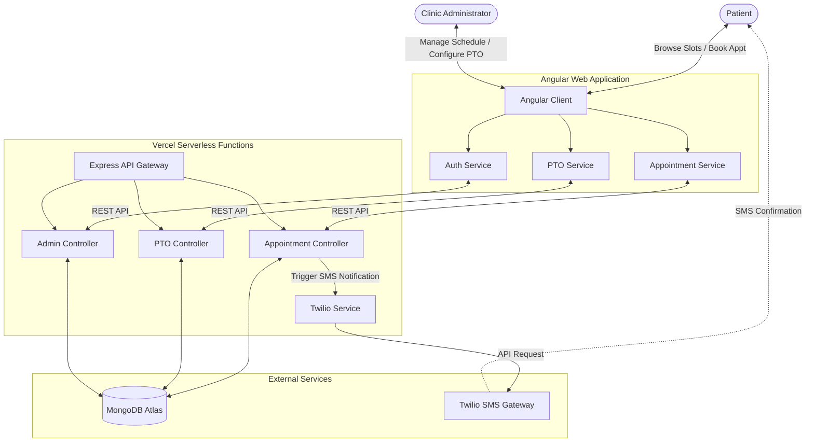

# 🏥 Pradeep Siddha Clinic - Doctor Appointment App

[](https://pradeep-clinic.vercel.app/)
[](https://angular.dev/)
[](https://expressjs.com/)
[](https://www.mongodb.com/)
[](https://www.twilio.com/)

A modern, responsive, full-stack appointment scheduling application built for **Pradeep Siddha Clinic**. The platform allows patients to easily book consultations while providing clinic administrators with a secure dashboard to manage bookings, track appointments, schedule doctor PTO (Paid Time Off), and send automated/manual SMS reminders.

🔗 **Hosted Application URL**: [https://pradeep-clinic.vercel.app/](https://pradeep-clinic.vercel.app/)

---

## 🏗️ Architecture & How It Works

The application follows a decoupled client-server architecture deployed on **Vercel** with **MongoDB Atlas** as the database layer and **Twilio** as the communications layer.



---

## 🛠️ Tech Stack

### Frontend
- **Framework**: [Angular v22](https://angular.dev/) (Modern Component-based architecture)
- **State Management**: Angular [Signals](https://angular.dev/guide/signals) (`signal`, `computed`) for reactive data binding
- **Styling**: Vanilla [SCSS](https://sass-lang.com/) (Modular stylesheets, design variables, and responsive layout)
- **Form Controls**: Angular template-driven forms

### Backend
- **Framework**: [Express.js](https://expressjs.com/) on [Node.js](https://nodejs.org/)
- **Programming Language**: [TypeScript](https://www.typescriptlang.org/) (Strict typing compile-to-JS workflow)
- **Database ODM**: [Mongoose](https://mongoosejs.com/) (MongoDB Object Document Modeling)
- **SMS Client**: [Twilio Node SDK](https://www.twilio.com/docs/libraries/node)

### Database & External Services
- **Database**: [MongoDB](https://www.mongodb.com/) (Document database containing Collections for `appointments` and `doctor_ptos`)
- **SMS Gateway**: [Twilio API](https://www.twilio.com/) for sending transactional SMS notifications

---

## ✨ Available Features

### 📅 Patient Portal
1. **Interactive Monthly Calendar**: Custom-built calendar view mapping available dates, tracking current dates, and disabling past dates.
2. **Session Slot Allocation**:
   - **Morning Session**: 10:30 AM - 01:00 PM
   - **Evening Session**: 06:30 PM - 08:30 PM
3. **Automated Holiday & PTO Blocking**: 
   - Clinic weekly holidays (Wednesdays and Sundays) are automatically disabled.
   - Specific slots are automatically blocked dynamically if the doctor logs PTO.
4. **Duplicate Booking Prevention**: Strict compound indexes prevent patients from double-booking identical slots (Morning/Evening) on the same date with the same mobile number.
5. **Doctor Communication Direct-Link**: Generates a pre-filled SMS link (`sms:`) to let patients easily send manual appointment booking details directly to the doctor's phone.

### 🔑 Secured Admin Dashboard
1. **Credential-Based Login**: Protected administrative environment checked against secure backend-validated administrator credentials.
2. **Day-By-Day Appointment Viewer**: Interactive navigation controls let the clinic coordinator check active appointments date-by-date.
3. **Doctor PTO (Unavailability) Scheduling**: Form allowing administrators to declare doctor absence/unavailability for Morning, Evening, or both sessions on specific dates with reasons.
4. **Appointment Management**: Direct actions to delete/cancel scheduled appointments.
5. **Patient Reminders**: Generates single-click pre-filled SMS reminder links to notify patients about their upcoming appointments manually if needed.

### ✉️ Notification Alerts
- **Twilio SMS Dispatch**: Automated SMS notifications sent to patients upon successful appointment scheduling with slot info and timestamps.

---

## 🗃️ Database Schemas

### 1. Appointment (`appointments`)
Represents booked clinic slots.
```typescript
{
  patientName: { type: String, required: true },
  mobileNumber: { type: String, required: true },
  date: { type: Date, required: true },
  slot: { type: String, enum: ['morning', 'evening'], required: true }
}
// Unique compound index: { mobileNumber: 1, date: 1, slot: 1 }
```

### 2. Doctor PTO (`doctor_ptos`)
Represents scheduled time off or clinic slot suspensions.
```typescript
{
  doctorName: { type: String, required: true },
  date: { type: Date, required: true },
  slot: { type: String, enum: ['morning', 'evening'], required: true },
  reason: { type: String }
}
// Unique compound index: { doctorName: 1, date: 1, slot: 1 }
```

---

## ⚙️ Local Development Setup

### Prerequisites
- [Node.js](https://nodejs.org/) (v18.x or above recommended)
- [MongoDB](https://www.mongodb.com/) (Local installation or MongoDB Atlas Cloud URI)

### Monorepo Structure
```bash
doctor-appointment-app/
├── backend/      # Express NodeJS API
└── frontend/     # Angular Frontend Client
```

---

### 1. Backend Service Configuration
1. Navigate to the backend directory:
   ```bash
   cd backend
   ```
2. Install npm dependencies:
   ```bash
   npm install
   ```
3. Set up environment configuration:
   Create a `.env` file based on `.env.example`:
   ```bash
   cp .env.example .env
   ```
   Provide values for the following environment variables:
   ```env
   PORT=5000
   MONGODB_URI=your_mongodb_connection_uri
   ADMIN_USERNAME=your_admin_username
   ADMIN_PASSWORD=your_admin_password
   
   # Twilio Configuration (Optional, set placeholders to skip)
   TWILIO_ACCOUNT_SID=your_twilio_account_sid
   TWILIO_AUTH_TOKEN=your_twilio_auth_token
   TWILIO_PHONE_NUMBER=your_twilio_phone_number
   
   # CORS Permissions
   ALLOWED_ORIGINS=http://localhost:4200
   ```
4. **Seed Database** (Optional):
   Populate sample Doctor PTO / unavailability data for development:
   ```bash
   npm run seed
   ```
5. **Run in Development Mode**:
   ```bash
   npm run dev
   ```
   The backend server runs locally on `http://localhost:5000`.

---

### 2. Frontend Application Configuration
1. Navigate to the frontend directory:
   ```bash
   cd frontend
   ```
2. Install npm dependencies:
   ```bash
   npm install
   ```
3. **Environment Setup**:
   The application environment configurations are in `src/environments/`:
   - Development API Endpoint: `http://localhost:5000` (defined in `environment.development.ts`)
   - Production API Endpoint: relative to host (defined in `environment.ts` for Vercel integration)
4. **Run Development Server**:
   ```bash
   npm start
   ```
   The frontend application launches on `http://localhost:4200/`.

---

## 🚀 Vercel Deployment

Both client and API apps can be deployed instantly using **Vercel**. 

- **Frontend**: Serves static pages built via Angular compiler, resolving API requests to the same origin with routing rewrites configured inside [frontend/vercel.json](./frontend/vercel.json).
- **Backend**: Express routes are integrated into Vercel Serverless Functions mapping through [backend/vercel.json](./backend/vercel.json).

---
*Developed with care for Pradeep Siddha Clinic.*
